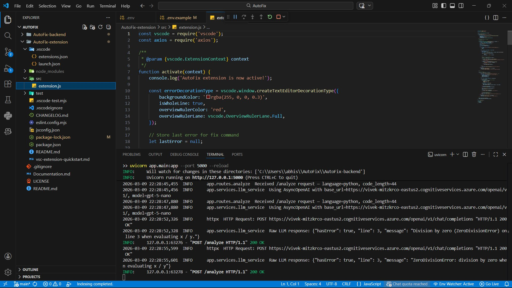
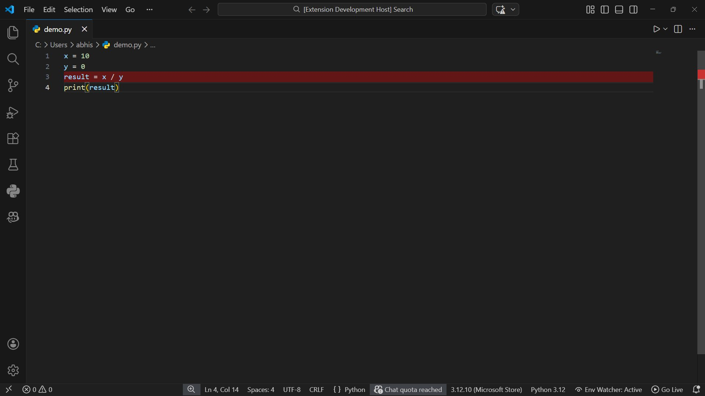
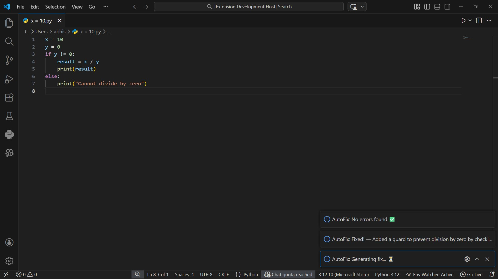
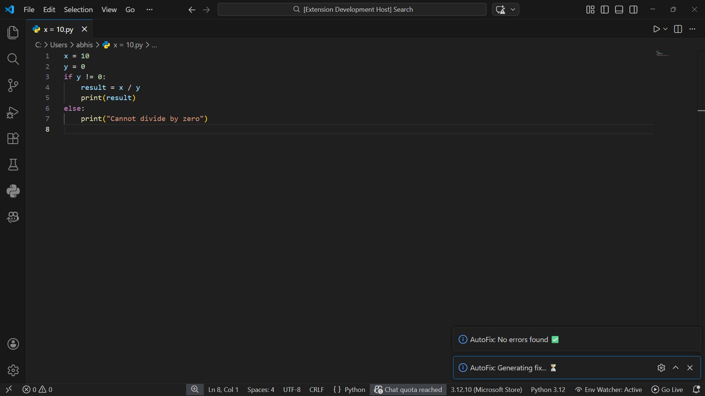

# 🔧 AutoFix — AI-Driven Bug Detection & Code Debugger for VS Code

> AutoFix is a Visual Studio Code extension that **automatically detects bugs in your code on every save** and offers **one-click AI-powered fixes** — powered by a FastAPI backend connected to **Azure AI Foundry (GPT-5-nano)**.

[](LICENSE)


---

## 📋 Table of Contents

1. [Project Overview](#1-project-overview)
2. [Features](#2-features)
3. [Architecture](#3-architecture)
4. [Project Structure](#4-project-structure)
5. [Tech Stack](#5-tech-stack)
6. [Quick Start Guide](#6-quick-start-guide)
7. [API Endpoints](#7-api-endpoints)
8. [Testing](#8-testing)
9. [Security](#9-security)
10. [Future Scope](#10-future-scope)
11. [Team](#11-team)
12. [License](#12-license)

---

## 1. Project Overview

**AutoFix** is a developer productivity tool that brings real-time AI-powered bug detection directly into Visual Studio Code. Every time you save a file (`Ctrl+S`), AutoFix silently analyzes your code, highlights any errors inline, and offers a one-click fix — no context switching, no manual debugging.

### 🔄 Demo Flow

```
Write code  →  Save (Ctrl+S)  →  Error detected  →  Line highlighted red
                                        ↓
               Click "🔧 Fix This"  →  Code auto-corrected  →  ✅ No errors
```

### 🎯 Goals

- Detect bugs in real time on every file save inside VS Code
- Provide context-aware AI corrections using Azure AI Foundry (GPT-5-nano)
- Support any programming language — Python, JavaScript, Java, C++, and more
- Expose a clean, rate-limited REST API for seamless editor integration
- Keep the tool lightweight, local, and stateless — no database, no remote accounts required

### 📌 Key Highlights

| Attribute | Details |
|---|---|
| Project Type | VS Code Extension + FastAPI Backend |
| Primary Language | Python (66.8%) + JavaScript (33.2%) |
| AI Model | Azure AI Foundry — GPT-5-nano |
| Repository | https://github.com/Gkbdc01/AutoFix |
| License | MIT |
| Status | Active — Version 1.1 |

---

## 2. Features

### Core Features
| Feature | Status | Description |
|---|---|---|
| 🔍 Error Detection on Save | ✅ Implemented | Analyzes code via LLM every time a file is saved |
| 🔴 Error Line Highlighting | ✅ Implemented | Highlights error and warning lines with color coding |
| 🔔 Toast Notifications | ✅ Implemented | Shows warning/info messages with error descriptions |
| 🩹 One-Click Fix | ✅ Implemented | "🔧 Fix This" button sends code to LLM and applies correction |
| 🌐 Multi-Language Support | ✅ Implemented | Works with Python, JavaScript, Java, C++, and any language |

### New in v1.1
| Feature | Status | Description |
|---|---|---|
| 🎯 Multi-Error Support | ✅ NEW | Detects and displays up to 5 errors per file, not just the most critical |
| 🔀 Diff Preview | ✅ NEW | Side-by-side preview of changes before applying fixes |
| ⚡ Smart Caching | ✅ NEW | Caches analysis results to reduce redundant API calls |
| 📊 Error Dashboard | ✅ NEW | Sidebar panel showing error statistics and recent errors |
| ⚙️ Custom Configuration | ✅ NEW | `.autofixconfig.json` support for severity levels and rule customization |
| 🎨 Severity Levels | ✅ NEW | Errors and warnings with different colors (red/orange highlighting) |
| 🔄 Debouncing | ✅ NEW | Smart debouncing prevents analysis during rapid saves |
| 📈 Error History | ✅ NEW | Backend tracks all detected errors for analytics |

### Enterprise Features
| Feature | Status | Description |
|---|---|---|
| 🚦 Rate Limiting | ✅ Implemented | 30 requests/min per IP via SlowAPI to prevent abuse |
| ✅ Input Validation | ✅ Implemented | Pydantic v2 models validate all incoming API requests |
| 🔒 CORS Configuration | ✅ Implemented | Configured for seamless extension ↔ backend communication |
| 📡 RESTful API | ✅ Implemented | Full REST API with Swagger docs at `/docs` |

---

## 3. Architecture

### 3.1 Architecture Diagram

```
┌──────────────────────┐    POST /analyze    ┌───────────────────┐    ┌─────────────────────┐
│  VS Code Extension   │ ─────────────────▶  │  FastAPI Backend  │ ──▶│  Azure AI Foundry   │
│  (JavaScript)        │ ◀─────────────────  │  (Python)         │ ◀──│  GPT-5-nano         │
│                      │    POST /fix         │                   │    │                     │
│  • Error highlighting│                      │  • Input valid.   │    │  • Code analysis    │
│  • Toast messages    │                      │  • Rate limiting  │    │  • Error detection  │
│  • One-click fix     │                      │  • CORS config    │    │  • Code correction  │
└──────────────────────┘                      └───────────────────┘    └─────────────────────┘
```

### 3.2 Data Flow

1. User saves a file in VS Code (`Ctrl+S`)
2. Extension captures the file content and language identifier
3. Extension sends a `POST /analyze` request to the FastAPI backend
4. Backend validates the input using Pydantic schemas
5. Backend checks rate limits (30 req/min per IP via SlowAPI)
6. Backend forwards the code to Azure AI Foundry (GPT-5-nano)
7. GPT-5-nano analyzes the code and returns error details (line, type, message)
8. Backend returns the structured response to the extension
9. If error found: extension highlights the line and shows a toast notification
10. User clicks "🔧 Fix This" — extension sends `POST /fix` to the backend
11. Backend calls GPT-5-nano with the code + error context
12. GPT-5-nano returns corrected code and explanation
13. Extension replaces the file content with the fixed code

### 3.3 Component Responsibilities

| Component | Technology | Responsibilities |
|---|---|---|
| VS Code Extension | JavaScript, VS Code API, Axios | Editor events, UI (highlights, toasts), HTTP calls to backend |
| FastAPI Backend | Python, FastAPI, Uvicorn | Request routing, validation, rate limiting, CORS, LLM orchestration |
| LLM Service | Azure AI Foundry, GPT-5-nano | Code analysis, error detection, code correction, explanations |
| Pydantic Models | Pydantic v2 | Request/response schema validation and serialization |
| Rate Limiter | SlowAPI | IP-based rate limiting at 30 requests per minute |

---

## 4. Project Structure

```
AutoFix/
├── AutoFix-extension/            # VS Code extension (JavaScript)
│   ├── src/
│   │   ├── extension.js          # Main extension logic (multi-error, caching, preview)
│   │   └── dashboard.js          # Error dashboard tree provider
│   ├── package.json              # Extension manifest with views
│   └── README.md
│
├── AutoFix-backend/              # FastAPI backend (Python)
│   ├── app/
│   │   ├── main.py               # App entry point
│   │   ├── routes/
│   │   │   ├── analyze.py        # POST /analyze (multi-error)
│   │   │   ├── fix.py            # POST /fix (with diff)
│   │   │   └── dashboard.py      # GET /history, /stats, /config
│   │   ├── services/
│   │   │   ├── llm_service.py    # Azure AI Foundry integration
│   │   │   ├── error_history.py  # Error tracking & stats
│   │   │   └── config_service.py # Configuration management
│   │   └── models/
│   │       └── schemas.py        # Pydantic models (with CodeError, ErrorStats)
│   ├── .env.example
│   ├── requirements.txt
│   └── README.md
│
├── .autofixconfig.json           # Configuration file (NEW)
├── screenshots/                  # Testing screenshots
├── Documentation.md
├── .gitignore
├── LICENSE
└── README.md
```

---

## 5. Tech Stack

| Component | Technology | Notes |
|---|---|---|
| VS Code Extension | JavaScript | VS Code Extension API |
| HTTP Client | Axios | REST calls from extension to backend |
| Backend Framework | FastAPI | Python async API framework |
| ASGI Server | Uvicorn | Runs FastAPI |
| AI / LLM | Azure AI Foundry (GPT-5-nano) | Code analysis and correction |
| Rate Limiting | SlowAPI | 30 req/min per IP |
| Input Validation | Pydantic v2 | Schema validation |

---

## 6. Quick Start Guide

### Prerequisites

| Requirement | Version |
|---|---|
| Python | 3.9+ |
| Node.js | 16+ |
| Visual Studio Code | Latest |
| Azure AI Foundry API Key | — |

### 6.1 Backend Setup

```bash
git clone https://github.com/Gkbdc01/AutoFix.git
cd AutoFix/AutoFix-backend
python -m venv venv
venv\Scripts\activate        # Windows
pip install -r requirements.txt
cp .env.example .env         # Add your Azure API key
uvicorn app.main:app --port 5000 --reload
```

### 6.2 Extension Setup

```bash
cd AutoFix-extension
npm install
# Press F5 in VS Code → Select "VS Code Extension Development"
```

---

## 7. API Endpoints

**Base URL:** `http://localhost:5000`

### Core Endpoints
| Method | Endpoint | Description | Returns |
|---|---|---|---|
| `POST` | `/analyze` | Analyze code for bugs (multi-error) | `{ hasError, errors[], source }` |
| `POST` | `/fix` | Fix a detected error | `{ fixed, fixedCode, explanation, diff }` |
| `GET` | `/health` | Server health check | `{ status: "ok" }` |

### New Analytics Endpoints (v1.1)
| Method | Endpoint | Description | Returns |
|---|---|---|---|
| `GET` | `/history` | Get recent error history | `{ count, errors[] }` |
| `GET` | `/stats` | Get error statistics | `{ totalErrors, errorsByType, errorsBySeverity, recentErrors[] }` |
| `POST` | `/history/clear` | Clear error history | `{ status: "cleared" }` |
| `GET` | `/config` | Get current configuration | Configuration object |
| `POST` | `/config/reload` | Reload configuration from disk | `{ status, config }` |

### Documentation
| Endpoint | Description |
|---|---|
| `GET` | `/docs` — Interactive Swagger UI |
| `GET` | `/redoc` — ReDoc API documentation |

### 7.1 POST `/analyze` — Multiple Errors

**Request:**
```json
{
  "code": "def foo():\n  x = 10\n  y = 0\n  return x / y",
  "language": "python",
  "filePath": "/path/to/file.py"
}
```

**Response — Errors Found:**
```json
{
  "hasError": true,
  "errors": [
    {
      "line": 4,
      "message": "Division by zero error",
      "errorType": "logic",
      "severity": "error"
    },
    {
      "line": 2,
      "message": "Unused variable 'x'",
      "errorType": "general",
      "severity": "warning"
    }
  ],
  "source": "llm"
}
```

### 7.2 POST `/fix` — With Diff Preview

**Request:**
```json
{
  "code": "def foo():\n  return 10 / 0",
  "language": "python",
  "line": 2,
  "message": "Division by zero",
  "filePath": "/path/to/file.py"
}
```

**Response — Fix Generated:**
```json
{
  "fixed": true,
  "fixedCode": "def foo():\n  if y != 0:\n    return 10 / y\n  else:\n    return None",
  "explanation": "Added zero-check before division",
  "diff": "--- original.txt\n+++ fixed.txt\n@@ -1,2 +1,5 @@\n-  return 10 / 0\n+  if y != 0:\n+    return 10 / y\n+  else:\n+    return None",
  "source": "llm"
}
```

### 7.3 GET `/stats` — Error Statistics

**Response:**
```json
{
  "totalErrors": 42,
  "errorsByType": {
    "syntax": 8,
    "logic": 15,
    "performance": 12,
    "security": 7
  },
  "errorsBySeverity": {
    "error": 30,
    "warning": 12
  },
  "mostCommonFile": "/src/main.py",
  "recentErrors": [
    {
      "timestamp": "2024-03-24T10:30:45.123456",
      "filePath": "/src/app.js",
      "language": "javascript",
      "line": 45,
      "message": "Undefined variable 'config'",
      "errorType": "logic",
      "severity": "error",
      "fixed": false
    }
  ]
}
```

### 7.2 POST `/fix`

**Request:**
```json
{
  "code": "x = 10\ny = 0\nresult = x / y\nprint(result)",
  "language": "python",
  "line": 3,
  "message": "Division by zero error"
}
```

**Response:**
```json
{
  "fixed": true,
  "fixedCode": "x = 10\ny = 0\nif y != 0:\n    result = x / y\n    print(result)\nelse:\n    print('Cannot divide by zero')",
  "explanation": "Added a guard to prevent division by zero by checking if y != 0."
}
```

---

## 8. Testing

All testing was performed using two methods:
1. **VS Code Extension** (Extension Development Host) — end-to-end testing with real file save trigger
2. **Swagger UI** (`http://localhost:5000/docs`) — direct API testing

### 8.1 Test Environment

| Parameter | Details |
|---|---|
| Testing Tool | VS Code Extension Development Host + Swagger UI |
| Backend URL | http://localhost:5000 |
| AI Model | Azure AI Foundry — GPT-5-nano |
| Test Language | Python |
| Tester | Abhishek Narwar |

---

### 8.2 Step 1 — Backend Server Running

Backend started successfully. Terminal shows live logs — `/analyze` requests received, Azure AI Foundry connected, LLM responding with HTTP 200 OK.



> ✅ `Uvicorn running on http://127.0.0.1:5000` — Backend live, Azure AI Foundry responding.

---

### 8.3 Step 2 — Error Detection on File Save (Ctrl+S)

Opened `demo.py` with a division by zero bug and pressed `Ctrl+S`. AutoFix **automatically detected the error** and highlighted Line 3 in red — no manual trigger needed.

**Buggy Code:**
```python
x = 10
y = 0
result = x / y   ← Line 3: Division by zero bug
print(result)
```



> ✅ Line 3 highlighted red immediately after `Ctrl+S`. AI correctly identified division by zero.

---

### 8.4 Step 3 — AI Fix Applied Automatically

Clicked "🔧 Fix This" — AutoFix sent code to `/fix` endpoint. AI generated corrected code with a zero-check guard and **automatically replaced the file content**.

**Fixed Code (auto-applied):**
```python
x = 10
y = 0
if y != 0:
    result = x / y
    print(result)
else:
    print("Cannot divide by zero")
```



> ✅ `AutoFix: Fixed! — Added a guard to prevent division by zero` — Code corrected and applied automatically.

---

### 8.5 Step 4 — No Errors Found After Fix

After fix was applied, file was auto-saved and re-analyzed. AutoFix confirmed the code is now clean.



> ✅ `AutoFix: No errors found ✅` — Red highlight removed. Fix was successful.

---

### 8.6 API Test Cases (Swagger UI)

| Test ID | Test Case | Input | Expected | Actual | Status |
|---|---|---|---|---|---|
| TC-01 | Health check | GET `/health` | `{ "status": "ok" }` | `{ "status": "ok" }` | ✅ PASS |
| TC-02 | Detect division by zero | Python buggy code | hasError: true, line: 3 | hasError: true, line: 3 | ✅ PASS |
| TC-03 | Detect missing colon | `def hello()` | hasError: true, line: 1 | hasError: true, line: 1 | ✅ PASS |
| TC-04 | Valid code — no error | `x = 10; print(x)` | hasError: false | hasError: false | ✅ PASS |
| TC-05 | Fix division by zero | buggy division code | fixed: true, zero-check added | Fixed code with if/else guard | ✅ PASS |
| TC-06 | Fix missing colon | `def hello()` | fixed: true, colon added | `def hello():` returned | ✅ PASS |

---

### 8.7 Test Summary

| Category | Total | Passed | Failed |
|---|---|---|---|
| End-to-End Extension Testing | 4 | 4 | 0 |
| API Testing via Swagger | 6 | 6 | 0 |
| **Total** | **10** | **10** | **0** |

> ✅ **All 10 tests passed.** AutoFix successfully detects errors on file save, highlights the error line in red, applies AI-generated fixes automatically, and confirms clean code — complete end-to-end flow verified.

---

## 9. Security

| Practice | Status | Details |
|---|---|---|
| Rate Limiting | ✅ Active | 30 requests/min per IP via SlowAPI |
| Input Validation | ✅ Active | Pydantic v2 schema validation on all inputs |
| CORS | ✅ Configured | Scoped for extension ↔ backend communication |
| No Secrets in Repo | ✅ Safe | `.env` gitignored, `.env.example` provided |
| No Database | N/A | Stateless tool — no persistent user data |
| No Authentication | N/A | Local-only extension |

---

## 10. Future Scope

| Feature | Priority | Description |
|---|---|---|
| Multi-error Detection | 🔴 High | Detect all errors simultaneously, not just the first |
| Error Severity Levels | 🔴 High | Distinguish errors, warnings, and hints |
| Auto-fix on Save | 🟡 Medium | Apply fixes automatically without button click |
| Configurable Backend URL | 🟡 Medium | Custom backend URL via VS Code settings |
| Marketplace Publishing | 🟡 Medium | Publish to VS Code Extension Marketplace |
| Workspace-wide Analysis | 🟢 Low | Scan all files in a project |
| Diff View Before Fix | 🟢 Low | Preview changes before applying fix |

---

## 11. Team

| Member | Role | Responsibilities |
|---|---|---|
| **Vivek Chaudhary** | Backend / AI Lead | FastAPI backend, Azure AI Foundry integration, LLM service |
| **Gaurav Kumar** | Frontend Lead | VS Code extension, editor API, UI (highlights, toasts, fix button) |
| **Abhishek Narwar** | Testing & Documentation | End-to-end testing, API testing via Swagger, test case design, project documentation |

---

## 12. License

This project is licensed under the **MIT License**.

```
MIT License

Copyright (c) 2026 Gkbdc01

Permission is hereby granted, free of charge, to any person obtaining a copy
of this software and associated documentation files (the "Software"), to deal
in the Software without restriction, including without limitation the rights
to use, copy, modify, merge, publish, distribute, sublicense, and/or sell
copies of the Software, and to permit persons to whom the Software is
furnished to do so, subject to the following conditions:

The above copyright notice and this permission notice shall be included in all
copies or substantial portions of the Software.

THE SOFTWARE IS PROVIDED "AS IS", WITHOUT WARRANTY OF ANY KIND, EXPRESS OR
IMPLIED, INCLUDING BUT NOT LIMITED TO THE WARRANTIES OF MERCHANTABILITY,
FITNESS FOR A PARTICULAR PURPOSE AND NONINFRINGEMENT. IN NO EVENT SHALL THE
AUTHORS OR COPYRIGHT HOLDERS BE LIABLE FOR ANY CLAIM, DAMAGES OR OTHER
LIABILITY, WHETHER IN AN ACTION OF CONTRACT, TORT OR OTHERWISE, ARISING FROM,
OUT OF OR IN CONNECTION WITH THE SOFTWARE OR THE USE OR OTHER DEALINGS IN THE
SOFTWARE.
```

---

<p align="center">Built with ❤️ by the AutoFix Team &nbsp;·&nbsp; Powered by FastAPI & Azure AI Foundry &nbsp;·&nbsp; <a href="https://github.com/Gkbdc01/AutoFix">github.com/Gkbdc01/AutoFix</a></p>
